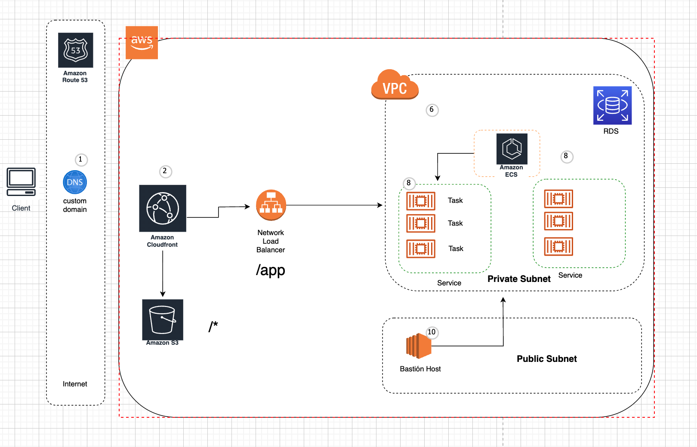
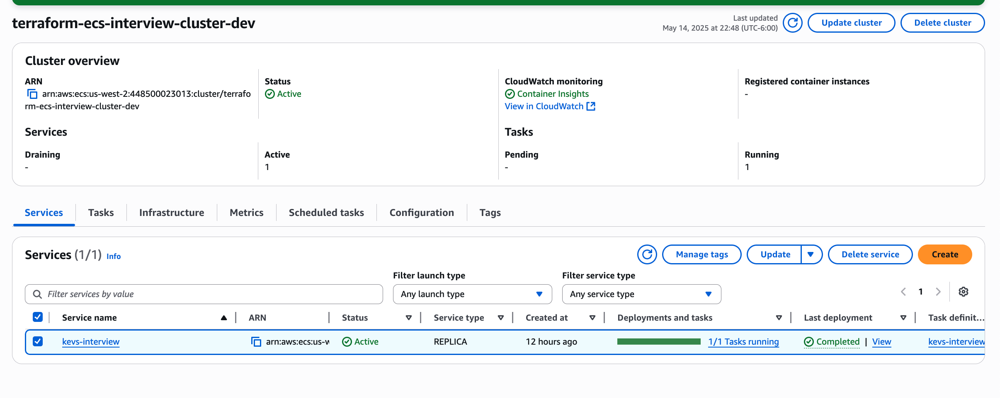
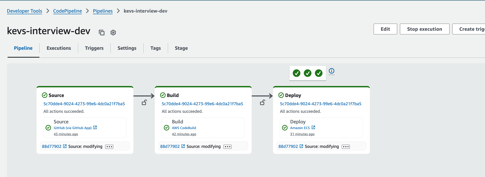

# terraform-ecs-kevs-interview

![Next][aws] ![Next][terraform]

I have created this proyect to show how i woulda deploy the contenirized app in ECS using
the well known terraform (i did it all in my personal account i have for labs )
Forgot to mention , i didnt set up cloudfrount yet just the ecs stuff

All the magic happens here , i have created these modules for building the following 

- Have a parameter store module (which will create some secrets in the future for this container)
- ECR : Creates the ecr repo
- ALB module : Creates my nlb for forwarding to my tasks in ECS  
- ECS : Creates the actual ECS
- CodePipeline Module : Creates the codepipeline 


``` hcl
#--------------------------
# Parameter Store
#---------------------------
module "parameter_store" {
  source       = "./modules/parameter_store"
  environment  = var.environment
  parameters   = local.ecs_parameters
  project-name = local.project_name
}

#--------------------------
# ECR Repositories config
#---------------------------
module "ecr" {
  source   = "./modules/ecr"
  services = local.services
}

#--------------------------
# Manage ALB
#---------------------------
module "LOAD_BALANCER" {
  source = "./modules/LOAD_BALANCER"

  services = local.services

  environment = var.environment
  vpc-id      = var.vpc-id

  load-balancer-name = "interview"
  public-subnets = []
  private-subnets    = ["subnet-02e065c37f823267e","subnet-0ffc7d0de8da60713"]
}

#--------------------------
# ECS Config
#---------------------------
module "ecs" {
  source = "./modules/ecs"

  services = local.services
  app-name = local.project_name

  environment    = var.environment
  region         = data.aws_region.current.name

  private-subnets  = ["subnet-02e065c37f823267e","subnet-0ffc7d0de8da60713"]
  target-groups    = module.LOAD_BALANCER.network-target-groups
  vpc-id           = var.vpc-id
  #project-name     = "refactor"


  depends_on = [module.parameter_store]
}

#--------------------------
# Configuracion de Pipeline para proyectos de terraform
#---------------------------
module "codepipeline" {
  source             = "./modules/codepipeline"
  AWS_ACCOUNT_ID     = data.aws_caller_identity.current.account_id
  codestar-arn       = var.codestar-arn
  environment        = var.environment
  project-name       = "interview"
  region             = var.region
  terraform-services = local.terraform-services
  ecs-cluster-name   = "${local.project_name}-cluster-${var.environment}"
  private-subnets    = ["subnet-02e065c37f823267e","subnet-0ffc7d0de8da60713"]
  vpc-id             = var.vpc-id

  services           = local.services
  depends_on = [module.ecs]
}
```

If we would like to add more services to ECS , we would add another service to this array and 
another service would born with a pipeline and everything set up 
 
```
services = [
    {
      name             = "kevs-interview",
      port             = "5000"
      type             = "python"
      git-account-name = "KevsAlex"
      git-name         = "kevin_alexis_meneses_interview-devops"
   
  ]
```



Proove it works



Pipeline for deploying this image

Additionally i have created a pipeline which deploys this app



[terraform]: https://img.shields.io/badge/terraform-%235835CC.svg?style=for-the-badge&logo=terraform&logoColor=white

[aws]: https://img.shields.io/badge/AWS-%23FF9900.svg?style=for-the-badge&logo=amazon-aws&logoColor=white